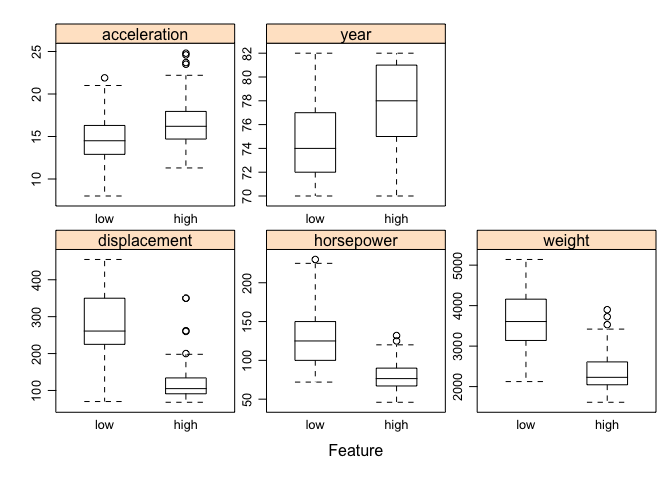
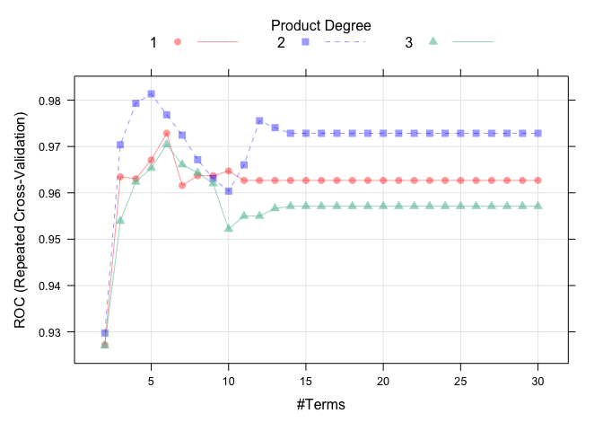
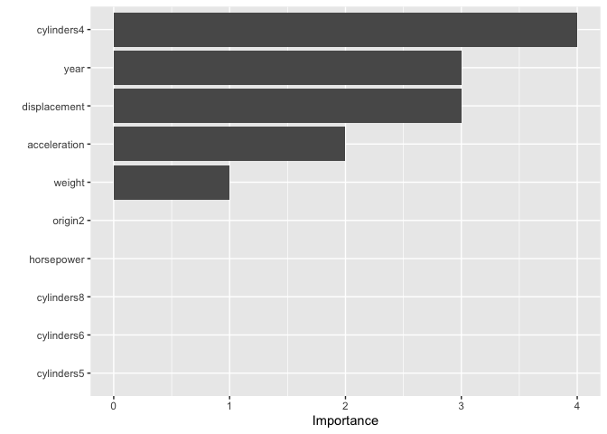
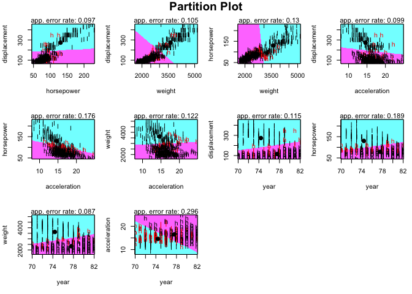
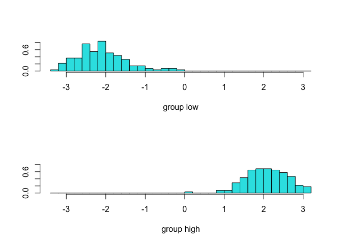
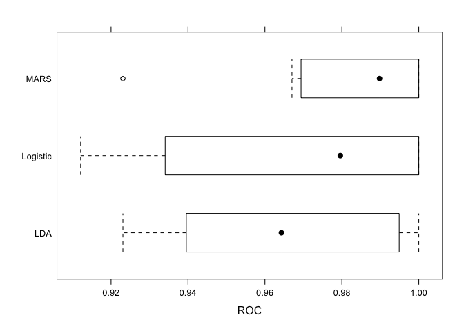
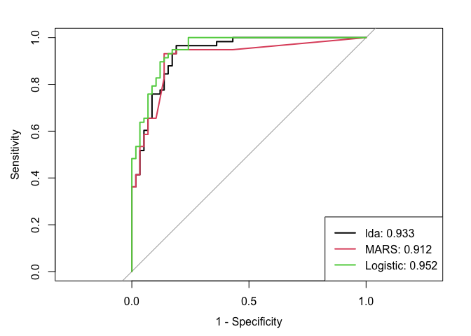

hw3_glm for classifier
================
Cary Ni
2023-03-13

``` r
# load the dataset, specifiy the factor variables
auto_df = read_csv("auto.csv", show_col_types = FALSE) %>% 
  janitor::clean_names() %>% 
  na.omit() %>% 
  mutate(
    cylinders = as_factor(cylinders),
    origin = as_factor(origin),
    mpg_cat = as_factor(mpg_cat))
# data partition
set.seed(2023)
index_auto = createDataPartition(y = auto_df$mpg_cat, p = 0.7, list = FALSE)
```

## Feature plot for simple visualization

``` r
# simple visualization of the data
theme1 <- transparentTheme(trans = .4)
trellis.par.set(theme1)
featurePlot(x = auto_df[, 2:6],
            y = auto_df$mpg_cat, 
            scales = list(x = list(relation = "free"),
                          y = list(relation = "free")),
            plot = "box", pch = "|",
            auto.key = list(columns = 2))
```

<!-- -->

## Logistic regression (without penalty)

``` r
# specify train method for logistic
ctrl_1 = trainControl(method = "repeatedcv",
                      summaryFunction = twoClassSummary,
                      classProbs = TRUE)
set.seed(1)
model_glm = train(x = auto_df[index_auto,1:7],
                  y = auto_df$mpg_cat[index_auto],
                  method = "glm",
                  metric = "ROC",
                  trControl = ctrl_1)
summary(model_glm)
```

    ## 
    ## Call:
    ## NULL
    ## 
    ## Deviance Residuals: 
    ##     Min       1Q   Median       3Q      Max  
    ## -1.9131  -0.0710   0.0023   0.1080   3.2853  
    ## 
    ## Coefficients:
    ##                Estimate Std. Error z value Pr(>|z|)    
    ## (Intercept)  -20.794747  10.372067  -2.005  0.04498 *  
    ## cylinders4     6.284585   2.083015   3.017  0.00255 ** 
    ## cylinders5     3.148913   2.684488   1.173  0.24079    
    ## cylinders6     3.929396   2.538437   1.548  0.12163    
    ## cylinders8     6.522300   3.844903   1.696  0.08982 .  
    ## displacement  -0.005818   0.022427  -0.259  0.79532    
    ## horsepower    -0.089772   0.041361  -2.170  0.02997 *  
    ## weight        -0.003022   0.001951  -1.548  0.12152    
    ## acceleration  -0.589138   0.269922  -2.183  0.02906 *  
    ## year           0.559166   0.135134   4.138 3.51e-05 ***
    ## origin2        1.113844   1.253791   0.888  0.37434    
    ## origin3        1.322713   1.260391   1.049  0.29397    
    ## ---
    ## Signif. codes:  0 '***' 0.001 '**' 0.01 '*' 0.05 '.' 0.1 ' ' 1
    ## 
    ## (Dispersion parameter for binomial family taken to be 1)
    ## 
    ##     Null deviance: 382.617  on 275  degrees of freedom
    ## Residual deviance:  71.188  on 264  degrees of freedom
    ## AIC: 95.188
    ## 
    ## Number of Fisher Scoring iterations: 8

``` r
contrasts(auto_df$mpg_cat)
```

    ##      high
    ## low     0
    ## high    1

``` r
# create confusion matrix (no specification for positive needed)
test_pred_prob = predict(model_glm, 
                         newdata = auto_df[-index_auto,],
                         type = "prob") %>% pull(high) %>% as_vector()
test_pred = rep("low", length(test_pred_prob))
# 50% chosen as threshold
test_pred[test_pred_prob>0.5] = "high"
confusionMatrix(data = as.factor(test_pred),
                reference = auto_df$mpg_cat[-index_auto])
```

    ## Confusion Matrix and Statistics
    ## 
    ##           Reference
    ## Prediction low high
    ##       low   50    6
    ##       high   8   52
    ##                                           
    ##                Accuracy : 0.8793          
    ##                  95% CI : (0.8058, 0.9324)
    ##     No Information Rate : 0.5             
    ##     P-Value [Acc > NIR] : <2e-16          
    ##                                           
    ##                   Kappa : 0.7586          
    ##                                           
    ##  Mcnemar's Test P-Value : 0.7893          
    ##                                           
    ##             Sensitivity : 0.8621          
    ##             Specificity : 0.8966          
    ##          Pos Pred Value : 0.8929          
    ##          Neg Pred Value : 0.8667          
    ##              Prevalence : 0.5000          
    ##          Detection Rate : 0.4310          
    ##    Detection Prevalence : 0.4828          
    ##       Balanced Accuracy : 0.8793          
    ##                                           
    ##        'Positive' Class : low             
    ## 

At the 0.05 significance level, `cylinder4`, `horsepower`,
`acceleration`, and `year` (treated as numerical instead of categorical
here) are significant predictors of our outcome `mpg_cat`. The confusion
matrix shows that the accuracy (overall fraction of correct predictions)
is about 87.9% (95% CI: 80.6% to 93.2%). The no information rate is 50%,
suggesting that if same class prediction are made for all observations,
the model would be an accurate classifier 50% times in this scenario. A
p-value around 0 indicates the model is statistically significantly
better than null classifier. Since the specification for positive has no
meaning when classifying either `low` or `high`, `low` is chosen as
default “positive” class. Therefore, the model is 86.2% sensitive (true
positives) and 89.7% specific (true negatives), with a positive
predictive value of 89.3% and a negative predictive value of 86.7%. The
kappa of 0.76 means that our inter-rater reliability is relatively high
compared to the agreement by chance.

## Multivariate adaptive regression spline (MARS)

``` r
set.seed(1)
# Set tuning parameters (30 as a reserved value for 4 significant and 6 non-significant predictors)
mars_grid = expand.grid(degree = 1:3, nprune = 2:30)
# Fit MARS model
mars_model = train(x = auto_df[index_auto,1:7],
                   y = auto_df$mpg_cat[index_auto], 
                   method = "earth",
                   tuneGrid = mars_grid,
                   metric = "ROC",
                   trControl = ctrl_1)
# Plot the model
plot(mars_model)
```

<!-- -->

``` r
summary(mars_model)
```

    ## Call: earth(x=tbl_df[276,7], y=factor.object, keepxy=TRUE,
    ##             glm=list(family=function.object, maxit=100), degree=2, nprune=5)
    ## 
    ## GLM coefficients
    ##                                                high
    ## (Intercept)                              -4.4341158
    ## cylinders4                                5.5598015
    ## cylinders4 * h(weight-2572)              -0.0083216
    ## h(250-displacement) * h(14-acceleration)  0.0131665
    ## h(250-displacement) * h(year-72)          0.0059492
    ## 
    ## GLM (family binomial, link logit):
    ##  nulldev  df       dev  df   devratio     AIC iters converged
    ##  382.617 275   73.8695 271      0.807   83.87     7         1
    ## 
    ## Earth selected 5 of 22 terms, and 5 of 11 predictors (nprune=5)
    ## Termination condition: Reached nk 23
    ## Importance: cylinders4, displacement, year, acceleration, weight, ...
    ## Number of terms at each degree of interaction: 1 1 3
    ## Earth GCV 0.05259811    RSS 13.38298    GRSq 0.7911294    RSq 0.8060438

``` r
# examine the importance of predictors
vip(mars_model$finalModel)
```

<!-- -->

## Partition plot and linear discriminants in LDA

``` r
# LDA based on every combination of two variables
partimat(mpg_cat ~ displacement + horsepower + weight + acceleration + year, 
         method = "lda", data = auto_df)
```

<!-- -->

``` r
set.seed(1)
model_lda = train(mpg_cat~.,
                  data = auto_df[index_auto,],
                  method = "lda",
                  metric = "ROC",
                  trControl = ctrl_1)
# show the coefficient of LDA boundary
model_lda$finalModel$scaling
```

    ##                        LD1
    ## cylinders4    3.2970553281
    ## cylinders5    1.4564644099
    ## cylinders6    0.3499614486
    ## cylinders8    0.5790352900
    ## displacement -0.0026314738
    ## horsepower   -0.0013436740
    ## weight       -0.0004428187
    ## acceleration -0.0864696966
    ## year          0.1165409647
    ## origin2       0.1417773968
    ## origin3       0.3220996574

``` r
# Plot the linear discriminant from LDA
lda_fit = lda(mpg_cat ~ ., data = auto_df[index_auto,])
auto_lda_values = predict(lda_fit)
ldahist(auto_lda_values$x, g = auto_lda_values$class)
```

<!-- -->

## Models comparsion

``` r
# comparison based on resampling
res = resamples(list(Logistic = model_glm,
                     MARS = mars_model,
                     LDA = model_lda))
summary(res)
```

    ## 
    ## Call:
    ## summary.resamples(object = res)
    ## 
    ## Models: Logistic, MARS, LDA 
    ## Number of resamples: 10 
    ## 
    ## ROC 
    ##               Min.   1st Qu.    Median      Mean   3rd Qu. Max. NA's
    ## Logistic 0.9120879 0.9416209 0.9795918 0.9682496 0.9974490    1    0
    ## MARS     0.9230769 0.9706633 0.9897959 0.9813579 1.0000000    1    0
    ## LDA      0.9230769 0.9419152 0.9642857 0.9658163 0.9947998    1    0
    ## 
    ## Sens 
    ##               Min.   1st Qu.    Median      Mean 3rd Qu. Max. NA's
    ## Logistic 0.7692308 0.8214286 0.9285714 0.9126374       1    1    0
    ## MARS     0.7142857 0.9285714 0.9642857 0.9269231       1    1    0
    ## LDA      0.7142857 0.9285714 0.9285714 0.9197802       1    1    0
    ## 
    ## Spec 
    ##               Min.   1st Qu.    Median      Mean   3rd Qu. Max. NA's
    ## Logistic 0.8461538 0.9285714 0.9285714 0.9483516 1.0000000    1    0
    ## MARS     0.8461538 0.9244505 0.9285714 0.9412088 1.0000000    1    0
    ## LDA      0.8461538 0.9244505 0.9285714 0.9269231 0.9285714    1    0

``` r
bwplot(res, metric = "ROC")
```

<!-- -->

``` r
# comparsion based on test data (ROC curves)
lda_pred = predict(model_lda, newdata = auto_df[-index_auto,], type = "prob")[,2]
mars_pred = predict(mars_model, newdata = auto_df[-index_auto,], type = "prob")[,2]
log_pred = predict(model_glm, newdata = auto_df[-index_auto,], type = "prob")[,2]
roc_lda = roc(auto_df$mpg_cat[-index_auto], lda_pred)
```

    ## Setting levels: control = low, case = high

    ## Setting direction: controls < cases

``` r
roc_mars = roc(auto_df$mpg_cat[-index_auto], mars_pred)
```

    ## Setting levels: control = low, case = high
    ## Setting direction: controls < cases

``` r
roc_log = roc(auto_df$mpg_cat[-index_auto], log_pred)
```

    ## Setting levels: control = low, case = high
    ## Setting direction: controls < cases

``` r
plot(roc_lda, legacy.axes = TRUE)
plot(roc_mars, col = 2, add = TRUE)
plot(roc_log, col = 3, add = TRUE)
auc = c(roc_lda$auc[1], roc_mars$auc[1], roc_log$auc[1])
modelNames = c("lda","MARS","Logistic")
legend("bottomright", legend = paste0(modelNames, ": ", round(auc,3)),
col = 1:3, lwd = 2)
```

<!-- -->

``` r
# 50% chosen as threshold for LDA
test_pred_lda = rep("low", length(lda_pred))
test_pred_lda[lda_pred>0.5] = "high"
confusionMatrix(data = as.factor(test_pred_lda),
                reference = auto_df$mpg_cat[-index_auto])
```

    ## Confusion Matrix and Statistics
    ## 
    ##           Reference
    ## Prediction low high
    ##       low   48    7
    ##       high  10   51
    ##                                           
    ##                Accuracy : 0.8534          
    ##                  95% CI : (0.7758, 0.9122)
    ##     No Information Rate : 0.5             
    ##     P-Value [Acc > NIR] : 1.478e-15       
    ##                                           
    ##                   Kappa : 0.7069          
    ##                                           
    ##  Mcnemar's Test P-Value : 0.6276          
    ##                                           
    ##             Sensitivity : 0.8276          
    ##             Specificity : 0.8793          
    ##          Pos Pred Value : 0.8727          
    ##          Neg Pred Value : 0.8361          
    ##              Prevalence : 0.5000          
    ##          Detection Rate : 0.4138          
    ##    Detection Prevalence : 0.4741          
    ##       Balanced Accuracy : 0.8534          
    ##                                           
    ##        'Positive' Class : low             
    ## 

``` r
# 50% chosen as threshold for MARS
test_pred_mars = rep("low", length(mars_pred))
test_pred_mars[mars_pred>0.5] = "high"
confusionMatrix(data = as.factor(test_pred_mars),
                reference = auto_df$mpg_cat[-index_auto])
```

    ## Confusion Matrix and Statistics
    ## 
    ##           Reference
    ## Prediction low high
    ##       low   50    6
    ##       high   8   52
    ##                                           
    ##                Accuracy : 0.8793          
    ##                  95% CI : (0.8058, 0.9324)
    ##     No Information Rate : 0.5             
    ##     P-Value [Acc > NIR] : <2e-16          
    ##                                           
    ##                   Kappa : 0.7586          
    ##                                           
    ##  Mcnemar's Test P-Value : 0.7893          
    ##                                           
    ##             Sensitivity : 0.8621          
    ##             Specificity : 0.8966          
    ##          Pos Pred Value : 0.8929          
    ##          Neg Pred Value : 0.8667          
    ##              Prevalence : 0.5000          
    ##          Detection Rate : 0.4310          
    ##    Detection Prevalence : 0.4828          
    ##       Balanced Accuracy : 0.8793          
    ##                                           
    ##        'Positive' Class : low             
    ## 

``` r
# 50% chosen as threshold for Logistic
test_pred_log = rep("low", length(log_pred))
test_pred_log[log_pred>0.5] = "high"
confusionMatrix(data = as.factor(test_pred_log),
                reference = auto_df$mpg_cat[-index_auto])
```

    ## Confusion Matrix and Statistics
    ## 
    ##           Reference
    ## Prediction low high
    ##       low   50    6
    ##       high   8   52
    ##                                           
    ##                Accuracy : 0.8793          
    ##                  95% CI : (0.8058, 0.9324)
    ##     No Information Rate : 0.5             
    ##     P-Value [Acc > NIR] : <2e-16          
    ##                                           
    ##                   Kappa : 0.7586          
    ##                                           
    ##  Mcnemar's Test P-Value : 0.7893          
    ##                                           
    ##             Sensitivity : 0.8621          
    ##             Specificity : 0.8966          
    ##          Pos Pred Value : 0.8929          
    ##          Neg Pred Value : 0.8667          
    ##              Prevalence : 0.5000          
    ##          Detection Rate : 0.4310          
    ##    Detection Prevalence : 0.4828          
    ##       Balanced Accuracy : 0.8793          
    ##                                           
    ##        'Positive' Class : low             
    ## 

Based on the cross validation results on Linear Discriminant Analysis
(LDA), Multivariate adaptive regression spline (MARS), and Logistic
regression, the MARS model has highest mean area under curve (AUC) and
thus be favored to make the predictions.

When fitting the three models above on the test dataset, Logistic
regression model has highest AUC of 0.952, while LDA gives AUC of 0.933
and MARS has AUC of 0.912. Selecting 50% as the threshold of
classification, both Logistic regression and MARS models give a
misclassification rate of 0.121 (proportion of misclassified sample)
while LDA gives a misclassification rate of 0.147. Thus it can be seen
that Logistic regression model has best predictability in this test
dataset.
